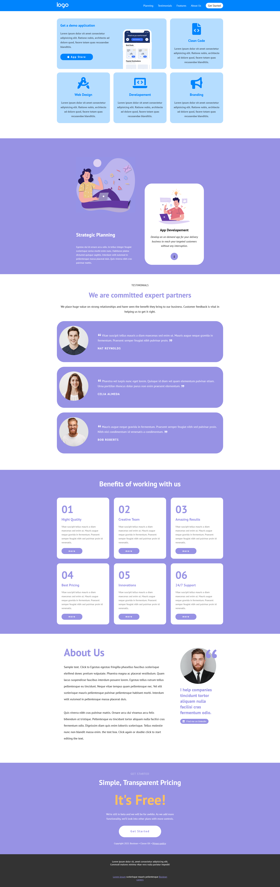
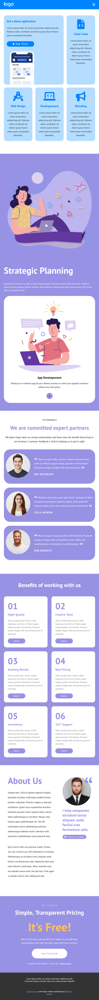

# Responsive Layout

In questo progetto viene riprodotta una pagina web nelle sue versioni desktop, tablet e mobile sfruttando le css queries appena studiate nella lezione del corso Boolean. Di seguito riportiamo le tre immagini dei layout richiesti:

## Desktop

## Tablet

## Mobile

